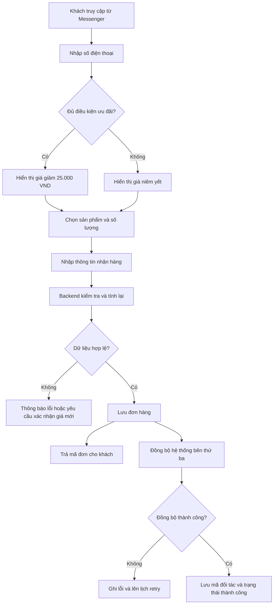

# PHÂN TÍCH YÊU CẦU WEBSITE BÁN HÀNG ƯU ĐÃI THEO SỐ ĐIỆN THOẠI

> Phiên bản: 1.0  
> Ngày cập nhật: 14/07/2026  
> Trạng thái: Draft — cần khách hàng xác nhận các nội dung được đánh dấu `CẦN XÁC NHẬN`  
> Mục đích: Làm nguồn yêu cầu đầu vào cho BA, Product Owner, UI/UX, Developer, QA và AI coding agent.

## 0. Hướng dẫn dành cho agent

1. Xem tài liệu này là nguồn yêu cầu nghiệp vụ chính của dự án.
2. Không tự giả định các nội dung được đánh dấu `CẦN XÁC NHẬN`.
3. Không dùng giá hoặc tổng tiền do frontend gửi lên làm dữ liệu chính thức.
4. Database là nguồn dữ liệu chính cho sản phẩm và đơn hàng.
5. Đơn hàng phải được lưu thành công trước khi đồng bộ sang hệ thống bên thứ ba.
6. Nếu Google Sheet, Pancake hoặc BEST Express lỗi, không được làm mất đơn hàng đã tạo.
7. Mọi thay đổi liên quan đến giá, ưu đãi, phí vận chuyển, thanh toán hoặc giới hạn sử dụng phải được xác nhận trước khi triển khai.
8. Ưu tiên MVP đơn giản nhưng thiết kế dữ liệu phải cho phép mở rộng.

---

## 1. Tổng quan sản phẩm

### 1.1. Bối cảnh

Khách hàng hiện bán hàng qua Fanpage và sử dụng Messenger để tiếp cận, tư vấn và thu hút khách. Khách hàng đã có tệp người mua cũ từ các đơn hàng trước đây, có thể đang được quản lý trên Pancake, Google Sheet, BEST Express hoặc file Excel.

Khách hàng muốn xây dựng một website bán hàng riêng để:

- Dẫn khách từ Messenger sang website.
- Tận dụng tệp khách hàng cũ.
- Tự động kiểm tra điều kiện ưu đãi bằng số điện thoại.
- Giảm công việc kiểm tra và chốt đơn thủ công.
- Cho phép khách tự chọn sản phẩm và đặt hàng.
- Quản lý sản phẩm, khách ưu đãi và đơn hàng tập trung.

Website dự kiến có khoảng 9 sản phẩm trong giai đoạn đầu.

### 1.2. Mục tiêu kinh doanh

- Tăng tỷ lệ khách hàng cũ quay lại mua hàng.
- Tăng tỷ lệ chuyển đổi từ Messenger sang đơn hàng.
- Giảm thời gian nhân viên tư vấn và kiểm tra ưu đãi.
- Áp dụng chính xác chính sách giảm 25.000 VND trên mỗi đơn vị sản phẩm.
- Chuẩn hóa dữ liệu đơn hàng phục vụ vận hành và đối soát.
- Tạo nền tảng có thể mở rộng thêm sản phẩm, voucher, tồn kho và thanh toán sau này.

### 1.3. Phạm vi tổng quát

Hệ thống gồm:

- Website dành cho người mua.
- Trang quản trị dành cho chủ cửa hàng/nhân viên.
- Backend API xử lý nghiệp vụ.
- Database lưu sản phẩm, khách ưu đãi và đơn hàng.
- Tích hợp Google Sheet và/hoặc Pancake.
- Khả năng tích hợp BEST Express nếu có API và nằm trong phạm vi được xác nhận.

---

## 2. Đối tượng sử dụng

| Đối tượng | Mục tiêu | Quyền chính |
|---|---|---|
| Người mua | Kiểm tra ưu đãi và đặt hàng | Kiểm tra SĐT, xem sản phẩm, quản lý giỏ, tạo đơn |
| Quản trị viên | Quản lý toàn bộ website | Quản lý sản phẩm, khách ưu đãi, đơn hàng, cấu hình |
| Nhân viên vận hành | Xử lý đơn hàng | Xem đơn, cập nhật trạng thái, retry tích hợp theo quyền |
| Pancake | Tiếp nhận/vận hành đơn | Nhận dữ liệu qua API — `CẦN XÁC NHẬN` |
| Google Sheet | Import, export hoặc đối soát | Nhận/xuất dữ liệu — `CẦN XÁC NHẬN` |
| BEST Express | Vận chuyển hoặc nguồn khách cũ | Tích hợp API hay thao tác thủ công — `CẦN XÁC NHẬN` |

---

## 3. Phạm vi MVP

### 3.1. Chức năng người mua

- Truy cập website từ Messenger, quảng cáo hoặc đường dẫn trực tiếp.
- Nhập số điện thoại trước khi vào gian hàng.
- Nhận kết quả đủ hoặc không đủ điều kiện ưu đãi.
- Xem danh sách sản phẩm theo mức giá tương ứng.
- Xem giá niêm yết, giá ưu đãi và số tiền được giảm.
- Chọn nhiều sản phẩm và số lượng.
- Thêm, sửa, xóa sản phẩm trong giỏ hàng.
- Xem tổng giá gốc, tổng giảm giá, phí vận chuyển và tổng thanh toán.
- Nhập thông tin người nhận hàng.
- Xác nhận đặt hàng.
- Nhận mã đơn và thông báo kết quả.

### 3.2. Chức năng quản trị

- Đăng nhập và đăng xuất.
- Thêm, sửa, ẩn/hiện sản phẩm.
- Quản lý SKU, tên, mô tả, hình ảnh, giá và trạng thái sản phẩm.
- Import danh sách số điện thoại ưu đãi từ CSV/Excel.
- Tìm kiếm, kích hoạt hoặc vô hiệu hóa khách ưu đãi.
- Xem danh sách và chi tiết đơn hàng.
- Cập nhật trạng thái đơn hàng.
- Xem trạng thái đồng bộ Google Sheet/Pancake.
- Thực hiện retry khi đồng bộ thất bại.
- Xuất báo cáo đơn hàng cơ bản.

### 3.3. Chức năng backend

- Chuẩn hóa và kiểm tra định dạng số điện thoại.
- Kiểm tra điều kiện ưu đãi.
- Phát hành promotion token có chữ ký và thời hạn.
- Cung cấp sản phẩm và giá phù hợp với phiên truy cập.
- Tính lại giá chính thức khi tạo đơn.
- Kiểm tra sản phẩm, số lượng và tồn kho nếu áp dụng.
- Chống sửa giá và tạo đơn trùng.
- Lưu đơn bằng database transaction.
- Tạo tác vụ đồng bộ bên thứ ba.
- Retry khi tích hợp lỗi.
- Ghi audit log và integration log.

### 3.4. Ngoài phạm vi MVP mặc định

Chỉ triển khai nếu được bổ sung và xác nhận:

- Tài khoản và đăng nhập dành cho người mua.
- Tích điểm khách hàng thân thiết.
- Nhiều loại voucher hoặc nhiều chương trình ưu đãi đồng thời.
- Thanh toán trực tuyến.
- Quản lý kho nâng cao.
- Tự động tạo và theo dõi vận đơn BEST Express.
- Đồng bộ hai chiều với Pancake.
- SMS, Zalo ZNS hoặc email automation.
- Dashboard phân tích doanh thu nâng cao.
- Ứng dụng mobile.

---

## 4. Luồng nghiệp vụ chính



### 4.1. Kiểm tra số điện thoại

1. Khách nhập số điện thoại.
2. Frontend kiểm tra định dạng cơ bản.
3. Backend chuẩn hóa số điện thoại về định dạng thống nhất.
4. Backend tra cứu danh sách khách đủ điều kiện.
5. Backend ghi log lần kiểm tra mà không làm lộ dữ liệu nhạy cảm.
6. Nếu hợp lệ, backend phát hành promotion token có thời hạn.
7. Frontend dùng kết quả để hiển thị giá ưu đãi hoặc giá thường.

API kiểm tra chỉ được trả về kết quả cần thiết, ví dụ:

```json
{
  "eligible": true,
  "promotionToken": "signed-token",
  "expiresAt": "2026-07-14T10:30:00Z"
}
```

Không trả về tên, địa chỉ, lịch sử đơn hoặc danh sách khách hàng.

### 4.2. Xem sản phẩm và giỏ hàng

- Frontend lấy danh sách sản phẩm đang hoạt động từ backend.
- Nếu phiên có ưu đãi hợp lệ, sản phẩm tham gia chương trình hiển thị giá giảm.
- Khi khách thay đổi số lượng, frontend cập nhật tổng tiền tức thời.
- Giá frontend chỉ phục vụ hiển thị; backend phải tính lại khi tạo đơn.

### 4.3. Tạo đơn hàng

Frontend chỉ gửi:

- Promotion token.
- Số điện thoại mở ưu đãi.
- Product ID và số lượng.
- Thông tin người nhận.
- Phương thức thanh toán.
- Ghi chú.
- Idempotency key.

Backend phải:

1. Kiểm tra promotion token và thời hạn.
2. Kiểm tra lại điều kiện của số điện thoại.
3. Lấy giá và trạng thái sản phẩm từ database.
4. Kiểm tra số lượng và tồn kho nếu có.
5. Tính tổng giá gốc, giảm giá, phí vận chuyển và tổng thanh toán.
6. Lưu đơn và các dòng sản phẩm trong cùng transaction.
7. Tạo integration job trong cùng transaction.
8. Commit dữ liệu.
9. Trả mã đơn ngay, không chờ Pancake/Google Sheet phản hồi.

### 4.4. Đồng bộ bên thứ ba

Luồng bắt buộc:

```text
Lưu order + order_items + integration_job trong cùng transaction
→ Commit
→ Worker gửi dữ liệu sang Pancake/Google Sheet
→ Lưu kết quả
→ Retry nếu thất bại
```

Không gọi hệ thống bên thứ ba trước rồi mới lưu đơn vào database.

---

## 5. Quy tắc nghiệp vụ

| Mã | Quy tắc | Trạng thái |
|---|---|---|
| BR-01 | Khách nhập số điện thoại trước khi vào gian hàng | Đã xác định |
| BR-02 | API chỉ trả kết quả đủ/không đủ điều kiện và token cần thiết | Đã xác định |
| BR-03 | Không yêu cầu OTP hoặc xác minh chủ số điện thoại | Đã xác định |
| BR-04 | Người mua được sử dụng SĐT khách cũ do người khác chia sẻ | Đã xác định |
| BR-05 | SĐT người nhận có thể khác SĐT mở ưu đãi | Đã xác định |
| BR-06 | Mức giảm là 25.000 VND trên mỗi đơn vị sản phẩm hợp lệ | Đã xác định |
| BR-07 | Backend quyết định giá cuối cùng | Đã xác định |
| BR-08 | Khách không hợp lệ được tiếp tục mua giá thường | `CẦN XÁC NHẬN` |
| BR-09 | Điều kiện là từng mua hay bắt buộc giao thành công | `CẦN XÁC NHẬN` |
| BR-10 | Nguồn danh sách khách cũ | `CẦN XÁC NHẬN` |
| BR-11 | Một SĐT được sử dụng ưu đãi bao nhiêu lần | `CẦN XÁC NHẬN` |
| BR-12 | Có giới hạn số sản phẩm được giảm trong một đơn | `CẦN XÁC NHẬN` |
| BR-13 | Tất cả hay chỉ một số sản phẩm được tham gia | `CẦN XÁC NHẬN` |
| BR-14 | Phí vận chuyển cố định hay theo địa chỉ | `CẦN XÁC NHẬN` |
| BR-15 | Có cộng dồn với chương trình khác không | `CẦN XÁC NHẬN` |
| BR-16 | Xử lý sản phẩm có giá nhỏ hơn 25.000 VND | `CẦN XÁC NHẬN` |
| BR-17 | Khi giá thay đổi, backend trả giá mới để khách xác nhận lại | Đề xuất |
| BR-18 | Sản phẩm bị ẩn không được dùng để tạo đơn mới | Đề xuất |
| BR-19 | Đơn hủy có hoàn lại lượt ưu đãi không | `CẦN XÁC NHẬN` |
| BR-20 | Chương trình có ngày bắt đầu/kết thúc không | `CẦN XÁC NHẬN` |

### 5.1. Công thức giá

```text
Tổng số lượng = Tổng số lượng của tất cả sản phẩm hợp lệ
Tổng giá gốc = Σ (Giá niêm yết × Số lượng)
Tổng giảm giá = Σ (Mức giảm của sản phẩm × Số lượng)
Tổng sau giảm = Tổng giá gốc − Tổng giảm giá
Tổng thanh toán = Tổng sau giảm + Phí vận chuyển
```

Ví dụ:

| Nội dung | Giá trị |
|---|---:|
| Sản phẩm A | 99.000 VND |
| Sản phẩm B | 129.000 VND |
| Sản phẩm C | 149.000 VND |
| Tổng giá gốc | 377.000 VND |
| Giảm 3 sản phẩm | -75.000 VND |
| Tổng sau giảm | 302.000 VND |
| Phí vận chuyển | Theo chính sách |
| Tổng thanh toán | Tổng sau giảm + phí vận chuyển |

### 5.2. Chuẩn hóa số điện thoại

Đề xuất chuẩn hóa:

- Loại bỏ khoảng trắng, dấu chấm và dấu gạch ngang.
- Chuyển `+84xxxxxxxxx` hoặc `84xxxxxxxxx` về `0xxxxxxxxx`.
- Chỉ chấp nhận định dạng số điện thoại Việt Nam hợp lệ theo cấu hình hệ thống.
- Lưu giá trị chuẩn hóa để so sánh nhất quán.

---

## 6. Yêu cầu dữ liệu

### 6.1. Bảng `admins`

| Trường | Kiểu gợi ý | Ghi chú |
|---|---|---|
| id | BIGSERIAL PK | ID |
| email | VARCHAR(255) UNIQUE | Tài khoản |
| password_hash | VARCHAR(255) | Mật khẩu đã băm |
| full_name | VARCHAR(150) | Họ tên |
| role | VARCHAR(30) | admin/operator |
| status | VARCHAR(20) | active/locked |
| last_login_at | TIMESTAMP NULL | Đăng nhập cuối |
| created_at | TIMESTAMP | Ngày tạo |
| updated_at | TIMESTAMP | Ngày cập nhật |

### 6.2. Bảng `eligible_customers`

| Trường | Kiểu gợi ý | Ghi chú |
|---|---|---|
| id | BIGSERIAL PK | ID |
| phone_normalized | VARCHAR(20) UNIQUE | SĐT chuẩn hóa, cần bảo vệ |
| phone_hash | VARCHAR(64) UNIQUE | Dùng tra cứu/log an toàn |
| source | VARCHAR(30) | sheet/pancake/best/import |
| source_customer_id | VARCHAR(100) NULL | ID từ nguồn |
| eligibility_reason | VARCHAR(50) | delivered/purchased/manual |
| successful_order_at | TIMESTAMP NULL | Ngày giao thành công |
| usage_count | INT DEFAULT 0 | Số lần đã dùng |
| usage_limit | INT NULL | NULL nghĩa không giới hạn |
| is_active | BOOLEAN | Trạng thái |
| imported_at | TIMESTAMP | Ngày import |
| created_at | TIMESTAMP | Ngày tạo |
| updated_at | TIMESTAMP | Ngày cập nhật |

Index: `UNIQUE(phone_hash)`, `(is_active, source)`.

### 6.3. Bảng `products`

| Trường | Kiểu gợi ý | Ghi chú |
|---|---|---|
| id | BIGSERIAL PK | ID |
| sku | VARCHAR(50) UNIQUE | Mã sản phẩm |
| name | VARCHAR(255) | Tên |
| slug | VARCHAR(255) UNIQUE | URL |
| description | TEXT | Mô tả |
| image_url | TEXT | Ảnh chính |
| listed_price | BIGINT | Giá VND |
| stock_quantity | INT NULL | NULL nếu không quản lý kho |
| is_promotion_eligible | BOOLEAN | Có tham gia ưu đãi |
| discount_amount | BIGINT DEFAULT 25000 | Mức giảm hiện tại |
| is_active | BOOLEAN | Trạng thái bán |
| sort_order | INT | Thứ tự |
| created_at | TIMESTAMP | Ngày tạo |
| updated_at | TIMESTAMP | Ngày cập nhật |
| deleted_at | TIMESTAMP NULL | Xóa mềm |

Ràng buộc: giá và tồn kho không âm; không xóa cứng sản phẩm đã có trong đơn.

### 6.4. Bảng `orders`

| Trường | Kiểu gợi ý | Ghi chú |
|---|---|---|
| id | BIGSERIAL PK | ID |
| order_code | VARCHAR(30) UNIQUE | Mã đơn |
| idempotency_key | VARCHAR(100) UNIQUE | Chống trùng |
| promotion_phone | VARCHAR(20) NULL | SĐT mở ưu đãi |
| is_promotion_applied | BOOLEAN | Trạng thái ưu đãi |
| recipient_name | VARCHAR(150) | Người nhận |
| recipient_phone | VARCHAR(20) | SĐT nhận |
| province | VARCHAR(100) | Tỉnh/thành |
| district | VARCHAR(100) | Quận/huyện |
| ward | VARCHAR(100) | Phường/xã |
| address | TEXT | Địa chỉ chi tiết |
| total_quantity | INT | Tổng số lượng |
| subtotal | BIGINT | Tổng giá gốc |
| discount_amount | BIGINT | Tổng giảm |
| shipping_fee | BIGINT | Phí vận chuyển |
| total_amount | BIGINT | Tổng thanh toán |
| payment_method | VARCHAR(30) | cod/bank_transfer/online |
| payment_status | VARCHAR(30) | Trạng thái thanh toán |
| order_status | VARCHAR(30) | Trạng thái đơn |
| pancake_order_id | VARCHAR(100) NULL | ID Pancake |
| shipping_order_id | VARCHAR(100) NULL | Mã vận đơn |
| note | TEXT NULL | Ghi chú |
| created_at | TIMESTAMP | Ngày tạo |
| updated_at | TIMESTAMP | Ngày cập nhật |

Index: `order_code`, `idempotency_key`, `(order_status, created_at)`, `recipient_phone`, `promotion_phone`.

### 6.5. Bảng `order_items`

| Trường | Kiểu gợi ý | Ghi chú |
|---|---|---|
| id | BIGSERIAL PK | ID |
| order_id | BIGINT FK | Đơn hàng |
| product_id | BIGINT FK | Sản phẩm |
| sku | VARCHAR(50) | Snapshot SKU |
| product_name | VARCHAR(255) | Snapshot tên |
| listed_price | BIGINT | Giá gốc lúc đặt |
| discount_per_item | BIGINT | Giảm trên một đơn vị |
| final_unit_price | BIGINT | Giá sau giảm |
| quantity | INT | Số lượng |
| line_subtotal | BIGINT | Giá gốc dòng |
| line_discount | BIGINT | Giảm giá dòng |
| line_total | BIGINT | Thành tiền dòng |

### 6.6. Bảng `promotion_checks`

| Trường | Kiểu gợi ý | Ghi chú |
|---|---|---|
| id | BIGSERIAL PK | ID |
| phone_hash | VARCHAR(64) | Không log SĐT rõ |
| is_eligible | BOOLEAN | Kết quả |
| token_id | UUID NULL | ID token |
| ip_hash | VARCHAR(64) NULL | Hỗ trợ chống spam |
| user_agent | VARCHAR(255) NULL | Thiết bị |
| checked_at | TIMESTAMP | Thời điểm |
| expires_at | TIMESTAMP NULL | Hết hạn token |

### 6.7. Bảng `integration_logs`

| Trường | Kiểu gợi ý | Ghi chú |
|---|---|---|
| id | BIGSERIAL PK | ID |
| order_id | BIGINT FK | Đơn liên quan |
| integration | VARCHAR(30) | pancake/sheet/best |
| action | VARCHAR(50) | create/update |
| status | VARCHAR(20) | pending/processing/success/failed |
| external_id | VARCHAR(100) NULL | ID hệ thống ngoài |
| attempt_count | INT DEFAULT 0 | Số lần thử |
| request_payload | JSONB NULL | Đã che dữ liệu nhạy cảm |
| response_payload | JSONB NULL | Phản hồi |
| error_message | TEXT NULL | Nội dung lỗi |
| next_retry_at | TIMESTAMP NULL | Lần thử tiếp |
| created_at | TIMESTAMP | Ngày tạo |
| updated_at | TIMESTAMP | Ngày cập nhật |

Index: `(status, next_retry_at)`, `(order_id, integration)`.

---

## 7. API dự kiến

### 7.1. API người mua

| Method | Endpoint | Chức năng | Xác thực |
|---|---|---|---|
| POST | `/api/v1/promotions/check` | Kiểm tra SĐT ưu đãi | Public, rate limit |
| GET | `/api/v1/products` | Danh sách sản phẩm | Public/token tùy chọn |
| GET | `/api/v1/products/:slug` | Chi tiết sản phẩm | Public |
| POST | `/api/v1/orders/quote` | Backend tính báo giá | Promotion token tùy trường hợp |
| POST | `/api/v1/orders` | Tạo đơn | Idempotency key |
| GET | `/api/v1/orders/:code` | Tra cứu đơn | Mã bảo mật hoặc SĐT — `CẦN XÁC NHẬN` |

### 7.2. API quản trị

| Method | Endpoint | Chức năng | Quyền |
|---|---|---|---|
| POST | `/api/v1/admin/auth/login` | Đăng nhập | Public |
| GET | `/api/v1/admin/products` | Danh sách sản phẩm | Admin/Operator |
| POST | `/api/v1/admin/products` | Thêm sản phẩm | Admin |
| PATCH | `/api/v1/admin/products/:id` | Sửa sản phẩm | Admin |
| PATCH | `/api/v1/admin/products/:id/status` | Ẩn/hiện | Admin |
| GET | `/api/v1/admin/orders` | Danh sách đơn | Admin/Operator |
| GET | `/api/v1/admin/orders/:id` | Chi tiết đơn | Admin/Operator |
| PATCH | `/api/v1/admin/orders/:id/status` | Cập nhật trạng thái | Admin/Operator |
| POST | `/api/v1/admin/eligible-customers/import` | Import khách ưu đãi | Admin |
| GET | `/api/v1/admin/integrations` | Xem trạng thái đồng bộ | Admin/Operator |
| POST | `/api/v1/admin/integrations/:id/retry` | Gửi lại | Admin/Operator |
| GET | `/api/v1/admin/reports/orders/export` | Xuất báo cáo | Admin |

### 7.3. Validation bắt buộc

- Reject trường không được định nghĩa trong DTO.
- Số lượng phải là số nguyên dương và có giới hạn tối đa.
- Product ID phải tồn tại và đang hoạt động.
- Không nhận giá sản phẩm từ frontend làm giá chính thức.
- Chuẩn hóa số điện thoại trước khi tra cứu.
- Giới hạn độ dài tên, địa chỉ và ghi chú.
- Kiểm tra promotion token, chữ ký và thời hạn.
- Tất cả API admin phải kiểm tra authentication và authorization.

---

## 8. Kiến trúc kỹ thuật đề xuất

### 8.1. Công nghệ

- Frontend: Next.js, TypeScript, Tailwind CSS hoặc hệ UI tương đương.
- Backend: NestJS, TypeScript.
- Database: PostgreSQL.
- ORM: Prisma hoặc TypeORM — chọn một và thống nhất toàn dự án.
- Lưu ảnh: S3, Google Cloud Storage hoặc dịch vụ tương đương.
- Worker: NestJS worker hoặc tiến trình riêng.
- Redis/BullMQ: chưa bắt buộc cho MVP; bổ sung khi cần queue/rate limit phân tán.
- API documentation: OpenAPI/Swagger.
- Đóng gói: Docker.
- Reverse proxy: Nginx hoặc Caddy.
- CI/CD: GitHub Actions hoặc nền tảng tương đương.

### 8.2. Phân chia trách nhiệm

| Thành phần | Trách nhiệm |
|---|---|
| Next.js | Giao diện, giỏ hàng, hiển thị giá tạm tính |
| NestJS | Nghiệp vụ, xác thực, tính giá chính thức, tạo đơn |
| PostgreSQL | Nguồn dữ liệu chính |
| Worker | Đồng bộ và retry |
| Google Sheet | Import/export/đối soát, không phải DB chính |
| Pancake | Vận hành đơn theo phạm vi tích hợp |
| BEST Express | Vận chuyển hoặc nguồn dữ liệu nếu được xác nhận |

### 8.3. Môi trường

- Local: phát triển trên máy cá nhân bằng Docker Compose.
- Development/Staging: kiểm thử nội bộ và UAT.
- Production: dữ liệu thật và traffic thật.

Không dùng chung database staging với production.

---

## 9. Bảo mật và chống gian lận

| Rủi ro | Biện pháp bắt buộc |
|---|---|
| Sửa giá bằng DevTools | Backend lấy giá từ DB và tính lại |
| Giả mạo product ID/số lượng | Validate sản phẩm, số lượng và trạng thái |
| Dò SĐT hợp lệ | Rate limit, CAPTCHA theo ngưỡng, log bất thường |
| Spam API | Giới hạn theo IP, thiết bị và phone hash |
| Tạo đơn trùng | Idempotency key và unique constraint |
| Token giả/hết hạn | Token có chữ ký, `exp` và `jti` |
| Lộ dữ liệu khách hàng | Mask SĐT, phân quyền, không log dữ liệu rõ |
| Mất đơn khi Pancake lỗi | Lưu DB trước, xử lý tích hợp bất đồng bộ |
| Chiếm tài khoản admin | Hash mật khẩu, rate limit đăng nhập, khóa tạm thời |
| XSS/SQL injection | Sanitize, parameterized query/ORM, CSP phù hợp |
| Upload file độc hại | Kiểm tra MIME, dung lượng, định dạng và tên file |

Lưu ý: vì nghiệp vụ cho phép chia sẻ số điện thoại và không dùng OTP, hệ thống không thể xác minh người sử dụng là chủ số điện thoại. Đây là quyết định kinh doanh đã được chấp nhận, không phải lỗi kỹ thuật.

---

## 10. Yêu cầu phi chức năng

| Nhóm | Mục tiêu đề xuất |
|---|---|
| Mobile-first | Hoạt động tốt trong trình duyệt Messenger/Facebook |
| Hiệu năng web | Nội dung chính tải dưới 3 giây trên mạng 4G |
| API kiểm tra | p95 dưới 500 ms khi tra cứu DB |
| Tạo đơn | Dưới 2 giây, không chờ tích hợp bên thứ ba |
| Bảo mật | HTTPS, validation, rate limit, phân quyền |
| Sao lưu | Backup DB hàng ngày, giữ 7–30 ngày |
| Logging | Có request ID, error log và integration log |
| Monitoring | Theo dõi lỗi API, DB, worker và số job chờ |
| Phục hồi | Retry theo cấp số nhân, có retry thủ công |
| SEO | Metadata, sitemap; xem lưu ý về phone gate |
| Khả năng mở rộng | Có thể tách worker và thêm Redis khi traffic tăng |

### 10.1. Lưu ý về SEO và chuyển đổi

Việc bắt buộc nhập số điện thoại trước khi xem toàn bộ sản phẩm có thể:

- Giảm khả năng Google index sản phẩm.
- Làm khách mới thoát trang.
- Giảm hiệu quả khi chia sẻ link sản phẩm.

Hai phương án cần khách hàng lựa chọn:

1. Bắt buộc nhập SĐT trước khi vào gian hàng, đúng luồng hiện tại.
2. Cho xem sản phẩm công khai, chỉ nhập SĐT để mở giá ưu đãi — phương án được khuyến nghị cho SEO và chuyển đổi.

---

## 11. Tiêu chí nghiệm thu

### AC-01 — Số điện thoại hợp lệ

**Given** SĐT nằm trong danh sách đang hoạt động  
**When** khách gửi yêu cầu kiểm tra  
**Then** hệ thống trả `eligible = true` và promotion token hợp lệ.

### AC-02 — Số điện thoại không hợp lệ

**Given** SĐT không nằm trong danh sách  
**When** khách kiểm tra  
**Then** hệ thống trả `eligible = false` và không làm lộ dữ liệu khách hàng.

### AC-03 — Hiển thị giá ưu đãi

**Given** khách có token hợp lệ  
**When** xem sản phẩm tham gia chương trình  
**Then** giá hiển thị được giảm 25.000 VND trên mỗi đơn vị.

### AC-04 — Cập nhật giỏ hàng

**Given** khách có sản phẩm trong giỏ  
**When** thay đổi số lượng  
**Then** tổng giá gốc, giảm giá và tổng thanh toán cập nhật ngay.

### AC-05 — Backend tính lại giá

**Given** frontend gửi Product ID và số lượng  
**When** tạo đơn  
**Then** backend lấy giá từ DB và tự tính lại toàn bộ.

### AC-06 — Ngăn sửa giá

**Given** khách sửa giá hoặc tổng tiền trên trình duyệt  
**When** gửi yêu cầu tạo đơn  
**Then** giá bị sửa không được sử dụng.

### AC-07 — Tạo đơn thành công

**Given** sản phẩm và thông tin người nhận hợp lệ  
**When** khách xác nhận đặt hàng  
**Then** hệ thống lưu đơn, order items và trả mã đơn.

### AC-08 — Chống tạo đơn trùng

**Given** nhiều request có cùng idempotency key  
**When** được gửi nhiều lần  
**Then** hệ thống chỉ tạo một đơn.

### AC-09 — Đồng bộ thành công

**Given** đơn đã lưu trong database  
**When** worker đồng bộ thành công  
**Then** hệ thống lưu external ID và trạng thái `success`.

### AC-10 — Retry khi tích hợp lỗi

**Given** Pancake hoặc Google Sheet lỗi  
**When** worker xử lý  
**Then** đơn không bị mất, lỗi được ghi nhận và tác vụ được retry.

### AC-11 — Quản trị sản phẩm

**Given** admin đã đăng nhập và có quyền  
**When** thêm, sửa hoặc ẩn sản phẩm  
**Then** dữ liệu được lưu và phản ánh đúng trên website.

---

## 12. Trường hợp kiểm thử bắt buộc

- SĐT hợp lệ, không hợp lệ và sai định dạng.
- SĐT dạng `+84`, `84` và `0` được chuẩn hóa nhất quán.
- Promotion token giả, sửa nội dung hoặc hết hạn.
- Mua một sản phẩm và nhiều sản phẩm.
- Mua nhiều đơn vị của cùng một sản phẩm.
- Sản phẩm đổi giá trong lúc khách đang đặt hàng.
- Sản phẩm bị ẩn trong lúc ở trong giỏ.
- Số lượng bằng 0, âm, dạng thập phân hoặc vượt giới hạn.
- Khách sửa giá/tổng tiền bằng DevTools.
- Gửi nút đặt hàng nhiều lần.
- Pancake/Google Sheet timeout hoặc trả lỗi.
- Retry thành công sau khi tích hợp phục hồi.
- Kiểm tra trên Chrome, Safari, Android, iPhone.
- Kiểm tra trong trình duyệt tích hợp của Messenger/Facebook.
- Kiểm tra phân quyền API admin.

---

## 13. Câu hỏi cần xác nhận trước khi phát triển

### 13.1. Bắt buộc trước khi báo giá

1. Danh sách khách ưu đãi lấy từ Google Sheet, Pancake, BEST Express hay Excel?
2. Tiêu chí hợp lệ là từng mua hàng hay bắt buộc đơn đã giao thành công?
3. Danh sách được import thủ công hay đồng bộ tự động?
4. Một SĐT được sử dụng ưu đãi bao nhiêu lần?
5. Mua ba sản phẩm giống nhau có được giảm 75.000 VND không?
6. Tất cả sản phẩm đều giảm hay admin chọn sản phẩm tham gia?
7. Có giới hạn số lượng được giảm trên một đơn không?
8. Khách không đủ điều kiện có được mua với giá thường không?
9. Phí vận chuyển cố định hay tính theo địa chỉ?
10. Website, Pancake hay hệ thống nào là nơi quản lý đơn chính?
11. Chỉ gửi đơn sang Pancake hay phải tự tạo vận đơn BEST Express?
12. Thanh toán bằng COD, chuyển khoản hay thanh toán online?
13. Có quản lý tồn kho không?
14. Có bắt buộc nhập SĐT trước khi xem sản phẩm không?

### 13.2. Thiết kế và nội dung

15. Đã có logo, màu sắc, hình ảnh và mô tả sản phẩm chưa?
16. Có website tham khảo không?
17. Cần những trang nội dung nào: giới thiệu, liên hệ, giao hàng, đổi trả, bảo mật?
18. Có cần Facebook Pixel, Google Analytics hoặc TikTok Pixel không?
19. Có yêu cầu SEO không?

### 13.3. Vận hành và hạ tầng

20. Có bao nhiêu tài khoản quản trị và cần phân quyền thế nào?
21. Đơn hàng có những trạng thái nào?
22. Có cần gửi SMS, Zalo hoặc email xác nhận đơn không?
23. Khách có cần tra cứu đơn không?
24. Cần những báo cáo nào?
25. Đã có domain và hosting chưa?
26. Dự kiến số lượt truy cập và số đơn mỗi ngày?
27. Phạm vi bảo hành và hỗ trợ vận hành?
28. Thời gian mong muốn Go-live?

---

## 14. Quy trình phát triển đề xuất

| Giai đoạn | Công việc | Đầu ra |
|---|---|---|
| Discovery | Khảo sát quy trình Fanpage, Pancake, BEST | As-Is, To-Be, câu hỏi mở |
| Define | Chốt MVP và business rules | PRD, backlog, acceptance criteria |
| UX/UI | Wireframe và prototype mobile-first | Thiết kế được duyệt |
| Solution Design | DB, API, bảo mật, tích hợp | ERD, API spec, kiến trúc |
| Development | Phát triển theo sprint | Chức năng trên staging |
| QA/UAT | Test chức năng, bảo mật, tích hợp | Test report, biên bản UAT |
| Release | Deploy production và chạy thử nhóm nhỏ | Website hoạt động |
| Measure | Theo dõi chuyển đổi và lỗi | Báo cáo KPI, backlog cải tiến |

### 14.1. Milestone MVP

1. Foundation: source code, database, Docker, CI/CD, đăng nhập admin.
2. Promotion: import khách cũ, kiểm tra SĐT, promotion token.
3. Shopping: sản phẩm, giá ưu đãi, giỏ hàng.
4. Checkout: thông tin nhận hàng, tính giá, tạo đơn.
5. Admin: quản lý sản phẩm và đơn hàng.
6. Integration: Google Sheet/Pancake và retry.
7. Go-live: UAT, triển khai, hướng dẫn vận hành.

### 14.2. Definition of Ready

Task chỉ được phát triển khi:

- Có mô tả mục tiêu.
- Có business rule liên quan.
- Có thiết kế hoặc mô tả giao diện.
- Có acceptance criteria.
- Đã xác định dependency.
- Có thể ước lượng.

### 14.3. Definition of Done

Task chỉ hoàn thành khi:

- Đúng acceptance criteria.
- Đã code review.
- Pass lint, typecheck, test và build.
- Đã kiểm tra validation và phân quyền.
- Không làm lộ dữ liệu nhạy cảm.
- Có migration nếu thay đổi database.
- Đã test responsive.
- Đã deploy staging.
- QA và Product Owner xác nhận.

---

## 15. Ước lượng sơ bộ

| Hạng mục | Ước lượng tương đối |
|---|---:|
| Làm rõ yêu cầu | 2–3 ngày |
| UX/UI | 3–5 ngày |
| Database và backend | 5–8 ngày |
| Website khách hàng | 5–8 ngày |
| Trang quản trị | 4–7 ngày |
| Google Sheet/Pancake | 3–7 ngày |
| QA, UAT và triển khai | 3–5 ngày |

Nếu một lập trình viên full-stack thực hiện, MVP dự kiến khoảng 4–6 tuần sau khi yêu cầu và tài liệu tích hợp đã được chốt. Đây không phải báo giá chính thức.

Các yếu tố có thể làm tăng thời gian và chi phí:

- Đồng bộ hai chiều với Pancake.
- Tự động tạo vận đơn BEST Express.
- Thanh toán online.
- Tồn kho hoặc biến thể sản phẩm phức tạp.
- Nhiều chương trình ưu đãi.
- Thiếu tài liệu hoặc quyền truy cập API bên thứ ba.
- Thiết kế riêng nhiều hiệu ứng.
- Báo cáo nâng cao.

---

## 16. KPI sau Go-live

### KPI kinh doanh

- Số lượt truy cập từ Messenger.
- Tỷ lệ khách nhập số điện thoại.
- Tỷ lệ SĐT đủ điều kiện.
- Tỷ lệ thêm sản phẩm vào giỏ.
- Tỷ lệ hoàn thành đơn.
- Giá trị đơn hàng trung bình.
- Số sản phẩm trung bình mỗi đơn.
- Tỷ lệ khách cũ quay lại.
- Tỷ lệ hủy và giao thất bại.

### KPI kỹ thuật

- Thời gian tải trang.
- Thời gian kiểm tra SĐT.
- Tỷ lệ API lỗi.
- Số đơn bị trùng.
- Tỷ lệ đồng bộ thành công.
- Số integration job đang chờ.
- Thời gian xử lý sự cố.

---

## 17. Checklist trước Go-live

- [ ] Khách hàng đã xác nhận toàn bộ business rules quan trọng.
- [ ] Đã duyệt UI/UX mobile và desktop.
- [ ] Đã cấu hình domain và HTTPS.
- [ ] Đã tạo production database.
- [ ] Backup tự động hoạt động.
- [ ] Secret và API key không nằm trong source code.
- [ ] Đã import tệp khách thật và kiểm tra mẫu.
- [ ] Đã xác nhận giá và trạng thái 9 sản phẩm.
- [ ] Đã xác nhận phí vận chuyển.
- [ ] Đã test đơn thật từ đầu đến cuối.
- [ ] Đã test Pancake/Google Sheet hoặc BEST theo phạm vi.
- [ ] Đã test trình duyệt Messenger/Facebook.
- [ ] Đã test chống sửa giá và đơn trùng.
- [ ] Đã có monitoring và cảnh báo cơ bản.
- [ ] Đã hướng dẫn quản trị và vận hành.
- [ ] Đã hoàn thành UAT và có xác nhận của khách hàng.

---

## 18. Nguyên tắc quản lý thay đổi

Mọi yêu cầu phát sinh phải ghi nhận:

- Nội dung thay đổi.
- Lý do.
- Mức độ ưu tiên.
- Ảnh hưởng đến UI, backend, database và tích hợp.
- Ảnh hưởng đến tiến độ và chi phí.
- Người phê duyệt.
- Phiên bản dự kiến triển khai.

Không đưa yêu cầu chưa được xác nhận vào sprint đang thực hiện.

---

## 19. Trạng thái quyết định

| Nhóm | Trạng thái |
|---|---|
| Mục tiêu sản phẩm | Đã xác định |
| Luồng ưu đãi cơ bản | Đã xác định |
| Mức giảm 25.000 VND/đơn vị | Đã xác định |
| Nguồn khách đủ điều kiện | Chưa xác nhận |
| Giới hạn sử dụng ưu đãi | Chưa xác nhận |
| Phí vận chuyển | Chưa xác nhận |
| Thanh toán | Chưa xác nhận |
| Tồn kho | Chưa xác nhận |
| Tích hợp Pancake | Chưa xác nhận chi tiết |
| Tích hợp Google Sheet | Chưa xác nhận chi tiết |
| Tích hợp BEST Express | Chưa xác nhận |
| UX phone gate và SEO | Chưa chốt phương án |
| Domain/hosting | Chưa xác nhận |

