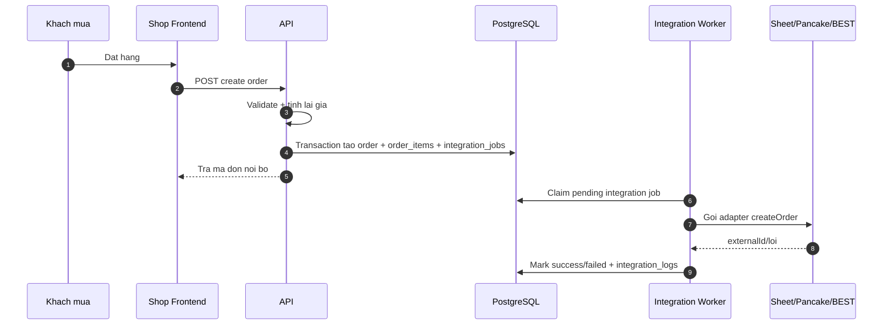
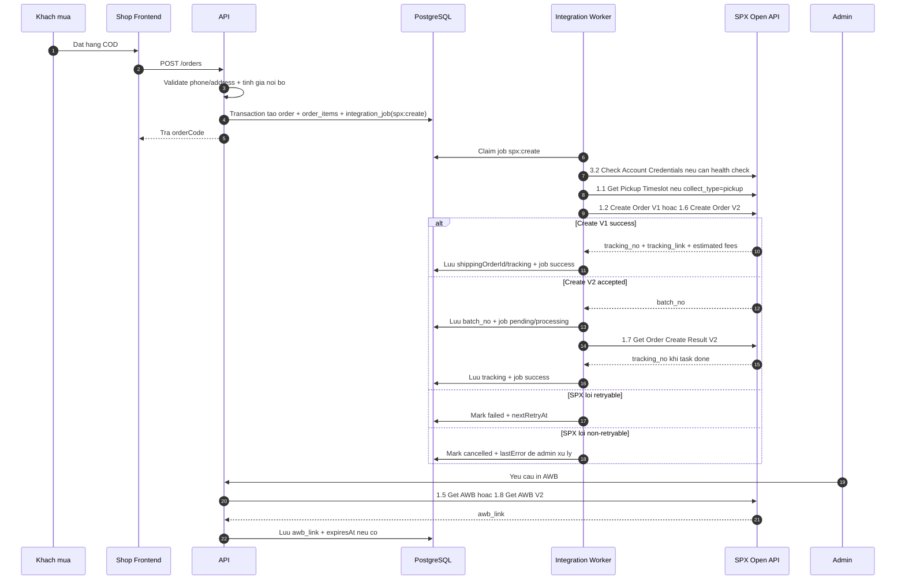
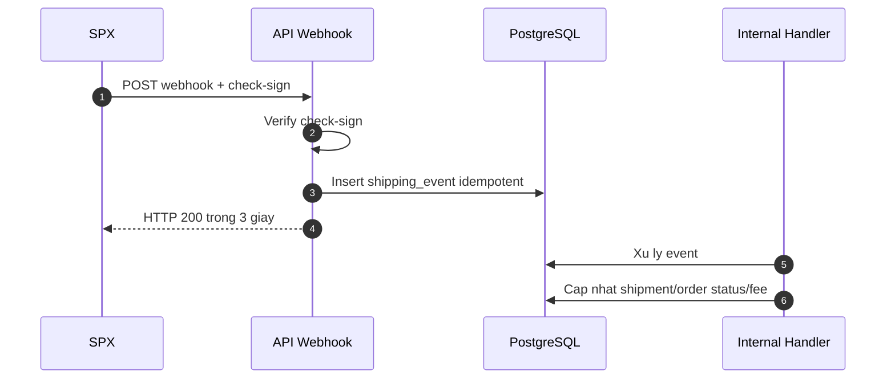

# Thiet ke luong tich hop SPX

Tai lieu nay mo ta cach gan SPX vao website hien tai. Day la ban thiet ke de review, chua phai implementation da chot.

## Muc tieu

- Giu nguyen luong checkout hien tai: backend tinh gia, luu order vao PostgreSQL, sau do moi dong bo doi tac.
- Them SPX lam doi tac van chuyen, khong thay the Pancake/Google Sheet.
- Luu duoc tracking number, trang thai giao hang, link AWB va phi ship thuc te.
- Xu ly loi SPX bang retry job, khong lam mat don hang noi bo.
- San sang nhan webhook SPX khi co public URL.

## Nguyen tac

- Order noi bo la source of truth cho mua hang.
- SPX la source of truth cho van don, tracking va phi ship thuc te sau khi tao van don.
- Khong tin gia/phi frontend gui len.
- Khong luu `app-secret`, `user-secret` trong code, repo, log.
- Tat ca request/response SPX trong log phai redact phone, secret, token.
- Webhook phai idempotent va return HTTP 200 trong 3 giay.

## Luong hien tai



## Luong de xuat voi SPX



## De xuat chon API

### MVP nen dung Create Order V1

Dung `1.2 Create Order` cho MVP vi:

- Flow worker hien tai dang xu ly request dong bo va mark success ngay.
- Tao don tra tracking number truc tiep, de map vao `shippingOrderId`.
- It can bang moi hon so voi V2 asynchronous.

Gioi han:

- Worker moi job hien tai xu ly tung order, nen batch limit 100 cua SPX chua tan dung ngay.
- Neu SPX response cham/timeout, job retry theo co che hien co.

### Khi nao dung Create Order V2

Dung V2 khi:

- Can tao nhieu van don theo batch that su.
- SPX sandbox/live V1 khong on dinh hoac SPX yeu cau V2.
- Muon nhan order create webhook va polling `batch_no`.

Neu dung V2, nen them action moi hoac state rieng cho job `create_result`, vi create lan dau chi tra `batch_no`, chua co `tracking_no`.

## Thay doi du lieu can co

### Toi thieu cho MVP

Hien co:

- `Order.shippingOrderId`: co the luu SPX `tracking_no`.
- `IntegrationJob.externalId`: luu `tracking_no`.
- `IntegrationJob.requestPayload`: luu `orderCode`, co the them `collect_type`, `service_type`.
- `IntegrationLog.responsePayload`: luu response da redact.

Can them vao Prisma enum:

- `IntegrationName.spx`

Can them vao config:

- `API_ORDER_INTEGRATIONS=sheet,pancake,spx`
- `SPX_ENV`
- `SPX_TEST_BASE_URL`
- `SPX_LIVE_BASE_URL`
- `SPX_APP_ID`
- `SPX_APP_SECRET`
- `SPX_USER_ID`
- `SPX_USER_SECRET`
- `SPX_DEFAULT_SERVICE_TYPE=1`
- `SPX_DEFAULT_COLLECT_TYPE=1`
- `SPX_SENDER_NAME`
- `SPX_SENDER_PHONE`
- `SPX_SENDER_STATE`
- `SPX_SENDER_CITY`
- `SPX_SENDER_DISTRICT`
- `SPX_SENDER_DETAIL_ADDRESS`

### Nen them cho production

Them bang rieng `shipping_shipments` de khong nhồi het vao `orders`:

| Field | Muc dich |
|---|---|
| `id` | khoa chinh |
| `order_id` | lien ket order noi bo |
| `provider` | `spx` |
| `tracking_no` | SPX tracking number |
| `tracking_link` | Link track SPX |
| `batch_no` | Dung cho V2 |
| `consignment_no` | Internal tracking no cua SPX neu webhook tra |
| `status_code` | Ma trang thai SPX |
| `status` | Trang thai SPX |
| `awb_link` | Link label tam thoi |
| `awb_expires_at` | Thoi diem het han label neu tinh duoc |
| `estimated_shipping_fee` | Phi uoc tinh tu SPX |
| `actual_shipping_fee` | Phi thuc te tu SPX |
| `chargeable_weight` | Trong luong tinh phi |
| `raw_last_event` | Payload webhook da redact |
| `created_at`, `updated_at` | Audit |

Them bang `shipping_events`:

| Field | Muc dich |
|---|---|
| `id` | khoa chinh |
| `shipment_id` | lien ket shipment |
| `provider_event_id` | `id` tu webhook neu co |
| `tracking_no` | tracking SPX |
| `event_type` | tracking/fee/evidence/ticket/create_feedback |
| `status_code` | ma trang thai |
| `payload` | payload da redact |
| `occurred_at` | timestamp tu SPX |
| `received_at` | luc he thong nhan |

Unique de idempotent:

- `provider_event_id` neu webhook co `id`
- fallback: `provider + tracking_no + event_type + status_code + occurred_at`

## Mapping order noi bo sang SPX

| Noi bo | SPX |
|---|---|
| `order.orderCode` | `orders[].order_id` |
| `recipientName` | `deliver_info.deliver_name` |
| `recipientPhone` | `deliver_info.deliver_phone` |
| `province` | `deliver_info.deliver_state` |
| `district` | `deliver_info.deliver_city` |
| `ward` | `deliver_info.deliver_district` |
| `address` | `deliver_info.deliver_detail_address` |
| `paymentMethod=cod` | `fulfillment_info.cod_collection=1` |
| `totalAmount` | `fulfillment_info.cod_amount` |
| `totalQuantity/items` | `parcel_info` va item description |
| `shippingFee` noi bo | Khong gui nhu phi chinh thuc; chi de hien thi/quote noi bo |

Sender info lay tu env/cau hinh shop:

- `SPX_SENDER_NAME`
- `SPX_SENDER_PHONE`
- `SPX_SENDER_STATE`
- `SPX_SENDER_CITY`
- `SPX_SENDER_DISTRICT`
- `SPX_SENDER_DETAIL_ADDRESS`

Can xac nhan them:

- Kich thuoc/trong luong default cho kien hang.
- Co cho mutual check/try on/partial delivery khong.
- Sender pay hay receiver pay.
- Pickup hay drop off.
- Co can high value processing khong.

## Adapter SPX

Them `SpxAdapter` rieng, khong dung `HttpIntegrationAdapter` generic, vi SPX can:

- Header `app-id`, `timestamp`, `random-num`, `check-sign`.
- Payload rieng theo schema SPX.
- Parse `ret_code=0` la success, khong dua vao HTTP status.
- Phan loai loi retryable/non-retryable theo `ret_code`.
- Extract `tracking_no`, `tracking_link`, `batch_no`.

Tra ve cho worker:

```ts
{
  externalId: trackingNo,
  responsePayload: redactedSpxResponse
}
```

Voi V1, `externalId = tracking_no`.

Voi V2 lan dau, co hai cach:

- Cach A: adapter tu polling 1.7 den khi done trong timeout ngan. Don gian nhung de timeout.
- Cach B: luu `batch_no`, job action/state rieng de worker tiep tuc polling. Tot hon cho production.

## Webhook SPX

Endpoint de xuat:

- `POST /api/v1/webhooks/spx/tracking`
- `POST /api/v1/webhooks/spx/order-create`
- `POST /api/v1/webhooks/spx/shipping-fee`
- Hoac gom lai: `POST /api/v1/webhooks/spx/:type`

Luong nhan webhook:



Xu ly:

- Verify `check-sign` bang cung thuat toan API request.
- Neu signature sai: reject 401/403, khong xu ly.
- Neu duplicate event: return 200.
- Tracking webhook cap nhat `shipping_shipments.status_code/status`.
- Shipping fee webhook cap nhat `actual_shipping_fee`.
- Evidence webhook luu URL proof vao event/raw payload, chua can hien UI trong MVP.

## Mapping trang thai de xuat

| SPX status_code | SPX status | OrderStatus noi bo |
|---|---|---|
| `1001` | Pending Pickup | `confirmed` hoac giu `pending` neu chua co trang thai confirmed |
| `2001` | In Transit | `shipping` |
| `5001` | Pickup Failed | `pending` + can admin xu ly |
| Delivered code | Delivered | `delivered` |
| Return/RTS code | Return/RTS | `cancelled` hoac trang thai moi neu bo sung |

Can xem bang Order status SPX day du truoc khi chot mapping, vi tai lieu hien tai moi co vi du `1001`, `2001`, `5001` va note `6003`, `7001`.

## Admin UX de xuat

Trong trang chi tiet don:

- Hien provider: `SPX`
- Hien tracking number va tracking link.
- Hien sync status cua job SPX.
- Nut `Retry SPX sync` dung API retry integration hien co.
- Nut `Get AWB` de lay label khi can in.
- Hien shipping status moi nhat.
- Hien actual shipping fee neu da co.

Trong danh sach integrations:

- Them filter/provider `spx`.
- Hien last error SPX da redact.

## Phase trien khai

### Phase 1: Sandbox create order V1

- Them enum `spx`.
- Them config SPX.
- Them `SpxAdapter`.
- Worker tao van don V1 va luu tracking number.
- Test signature bang test vector SPX.
- Test adapter voi mock fetch.

### Phase 2: Admin operation

- Hien tracking number trong admin.
- Retry job SPX tu man hinh sync hien co.
- Them action lay AWB.
- Luu link AWB tam thoi.

### Phase 3: Webhook tracking

- Them endpoint webhook.
- Verify signature.
- Luu event idempotent.
- Cap nhat shipment/order status.

### Phase 4: Fee reconciliation

- Goi 2.2 Get Order Fee theo lich hoac khi webhook fee ve.
- Luu actual shipping fee.
- Bao cao doi soat ship.

### Phase 5: V2/batch neu can

- Chuyen create order sang V2 neu SPX yeu cau.
- Luu `batch_no`.
- Poll 1.7 hoac nhan 4.2/4.3 webhook.

## Rủi ro va diem can xac nhan

- Dia chi hien tai cua checkout co `province/district/ward/address`; can dam bao mapping dung file address SPX Vietnam.
- Chua co trong luong/kich thuoc kien hang trong product/order, can default cau hinh hoac bo sung field.
- Chua ro pickup/dropoff shop se dung.
- Chua ro payment role: sender pay hay receiver pay.
- COD amount nen bang `totalAmount` noi bo khi payment method la COD.
- Link AWB het han sau 30 phut va gioi han 10 lan mo, khong nen coi la link vinh vien.
- Webhook can public URL HTTPS de SPX bind voi AppID.

## Cau hinh mau

```env
API_ORDER_INTEGRATIONS=sheet,pancake,spx

SPX_ENV=test
SPX_TEST_BASE_URL=https://test-stable.spx.vn/
SPX_LIVE_BASE_URL=https://spx.vn/
SPX_APP_ID=1000628
SPX_APP_SECRET=replace_with_spx_app_secret
SPX_USER_ID=
SPX_USER_SECRET=replace_with_spx_user_secret

SPX_DEFAULT_SERVICE_TYPE=1
SPX_DEFAULT_COLLECT_TYPE=1
SPX_PAYMENT_ROLE=1
SPX_ENABLE_COD=true
SPX_ALLOW_MUTUAL_CHECK=false
SPX_ALLOW_TRY_ON=false
SPX_ALLOW_PARTIAL_DELIVERY=false

SPX_SENDER_NAME=
SPX_SENDER_PHONE=
SPX_SENDER_STATE=
SPX_SENDER_CITY=
SPX_SENDER_DISTRICT=
SPX_SENDER_DETAIL_ADDRESS=
SPX_DEFAULT_WEIGHT_KG=0.5
SPX_DEFAULT_LENGTH_CM=10
SPX_DEFAULT_WIDTH_CM=10
SPX_DEFAULT_HEIGHT_CM=10
```
